## C/OpenCL Render

## GUI
|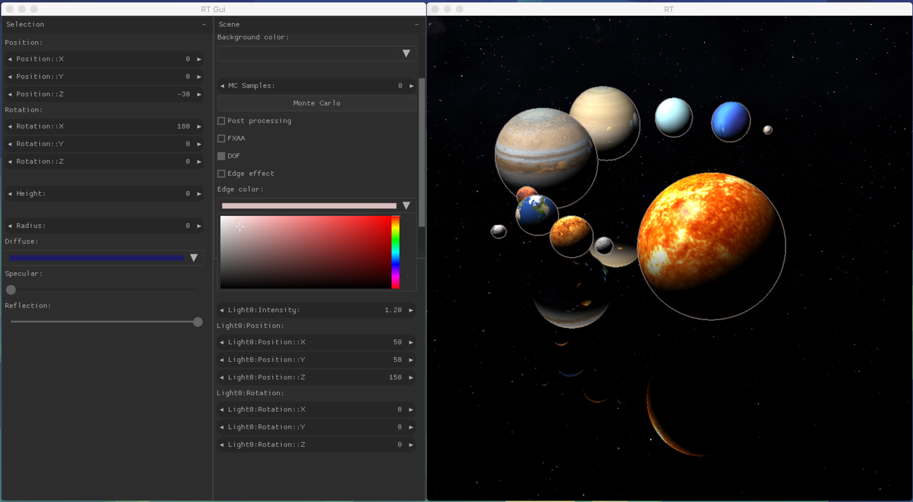|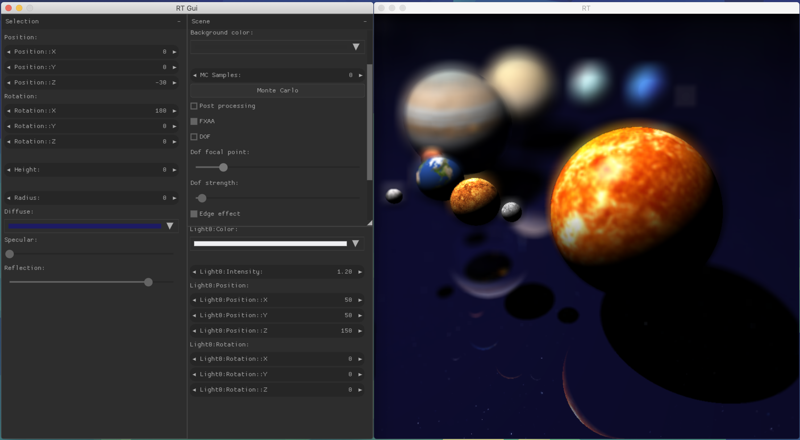
|------------------------|------------------------|

## Primitives : sphere, cube, plane, cylinder, cone, ellipse, paraboloid, hyperboloid with two sheets
|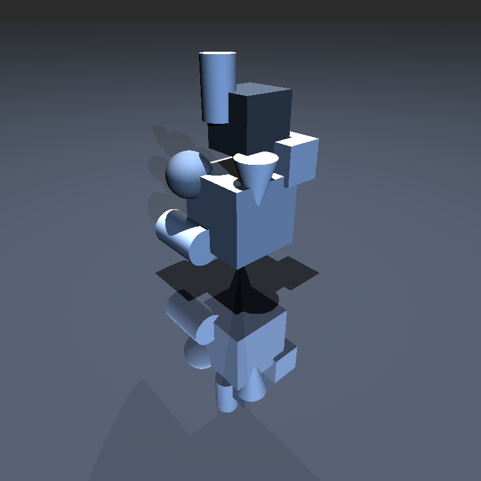|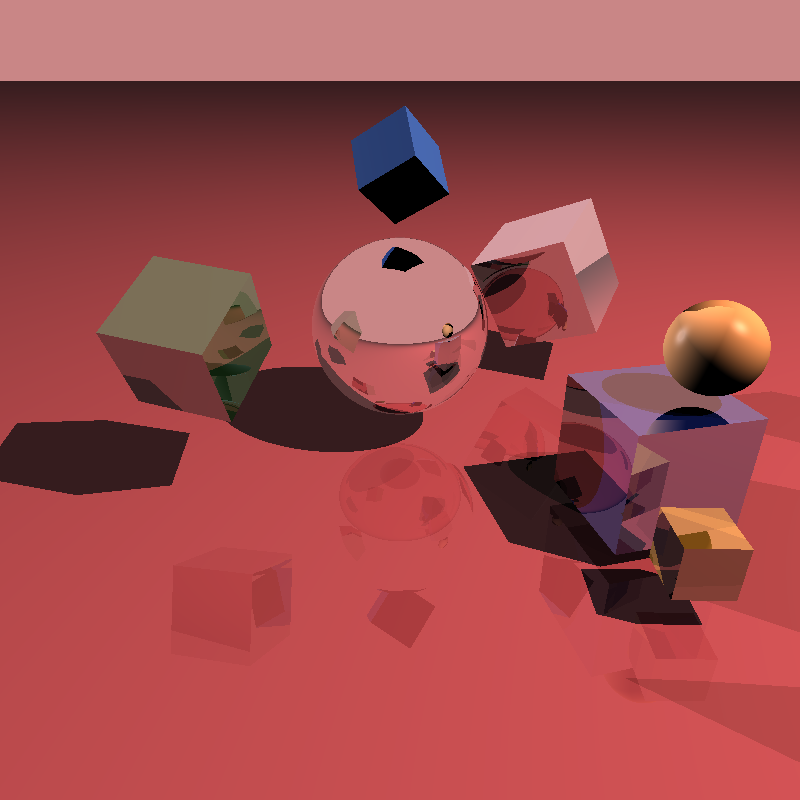|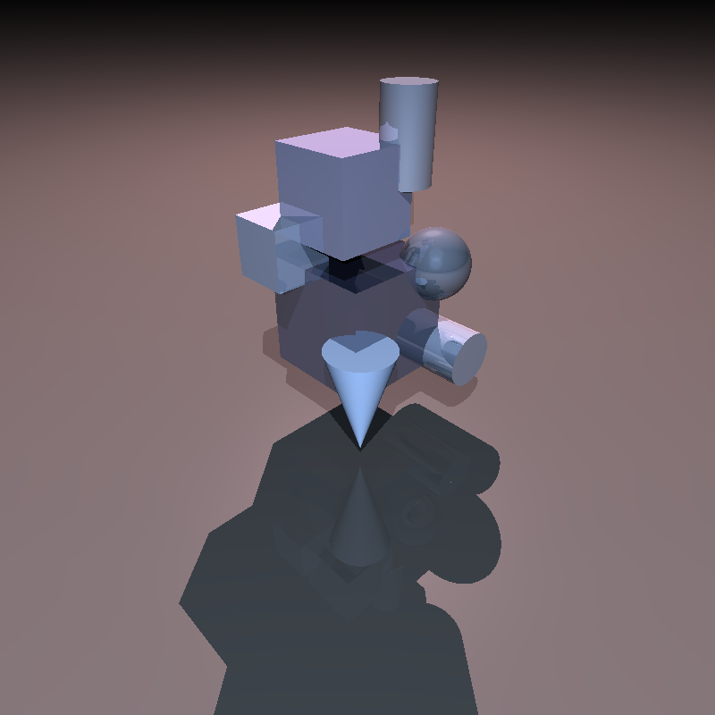
|------------------------|------------------------|------------------------|
|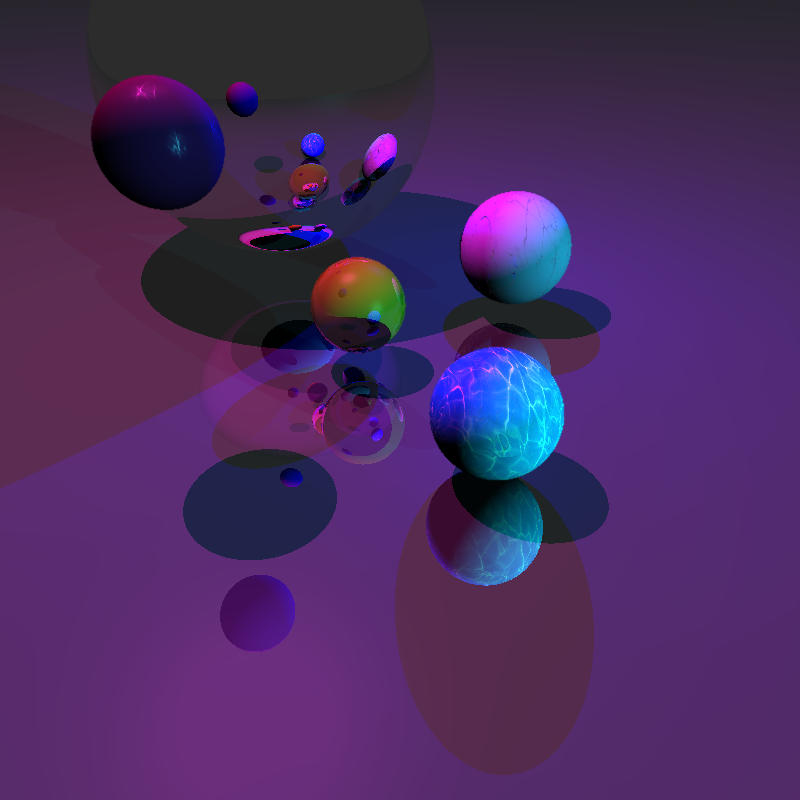|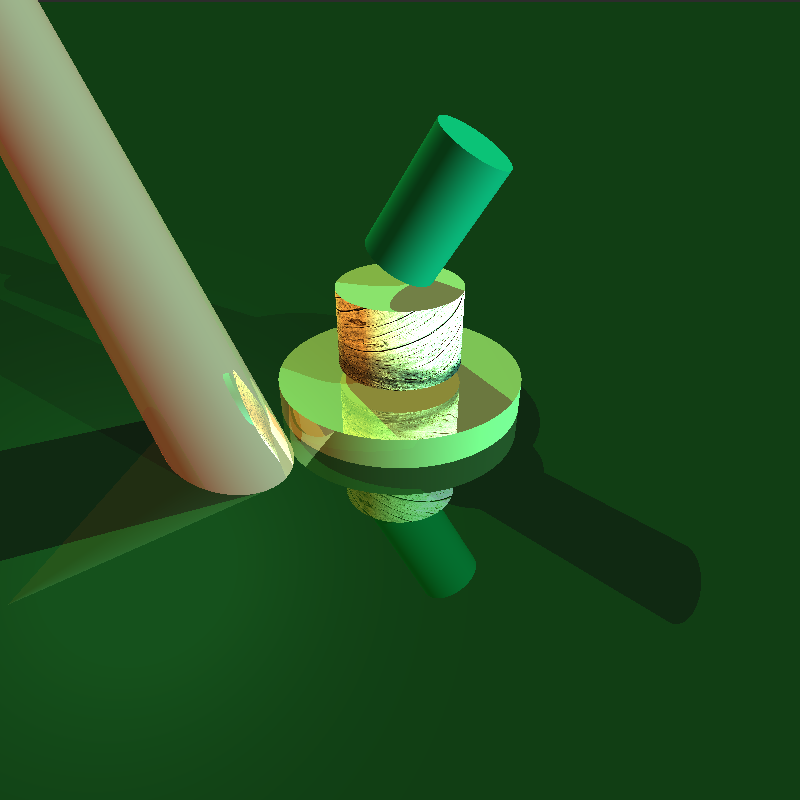|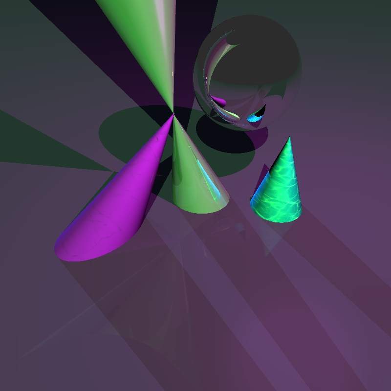
|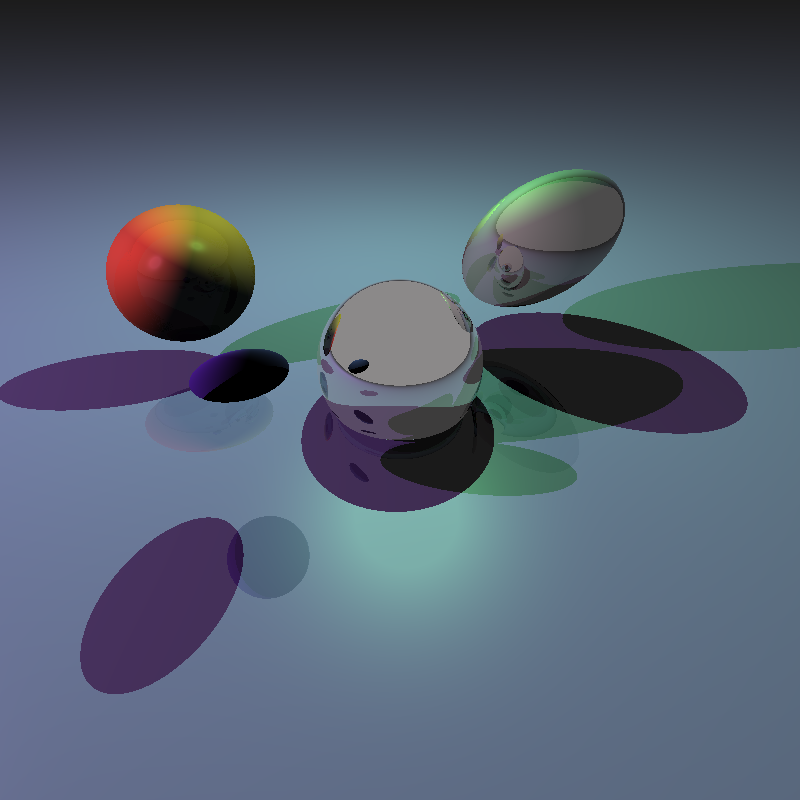|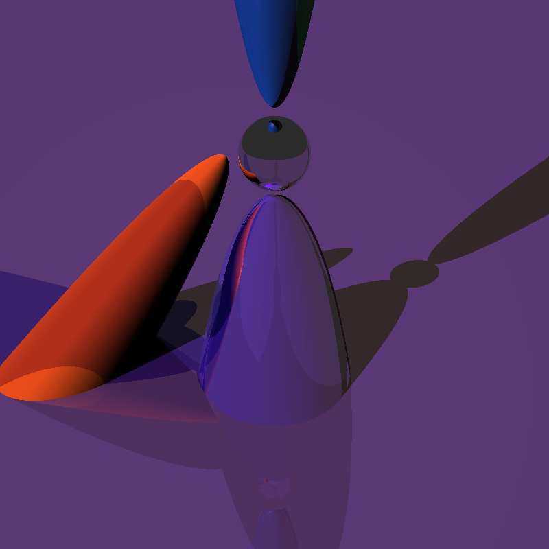|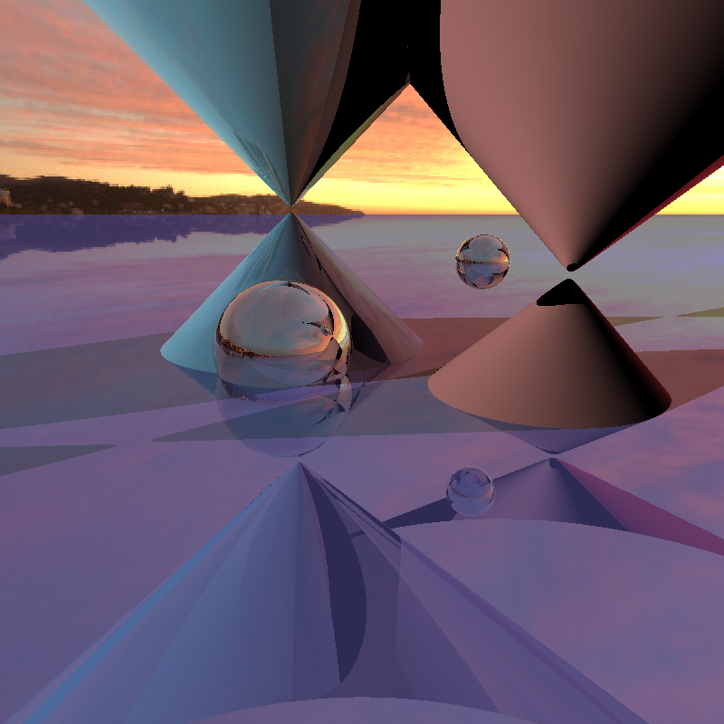

## Pathtracing. Effects : DOF, egde, reflection depth calculation, textures
|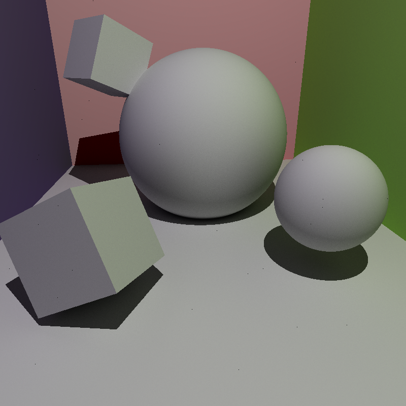|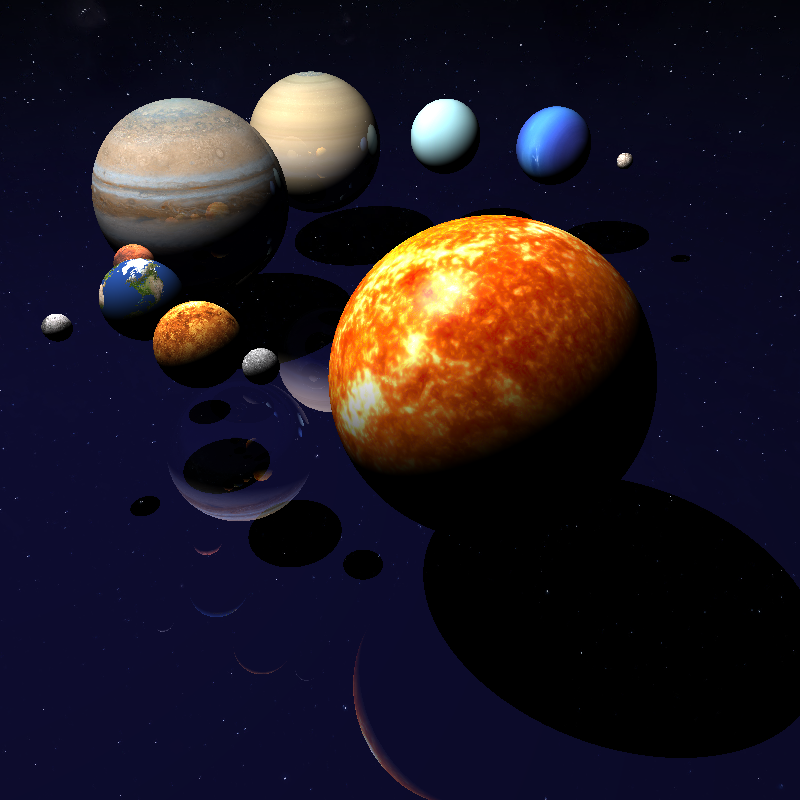|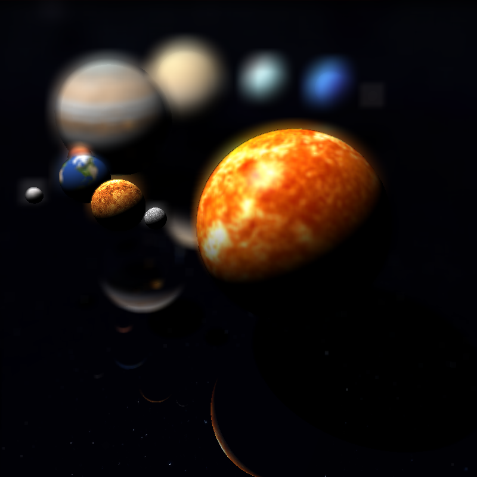|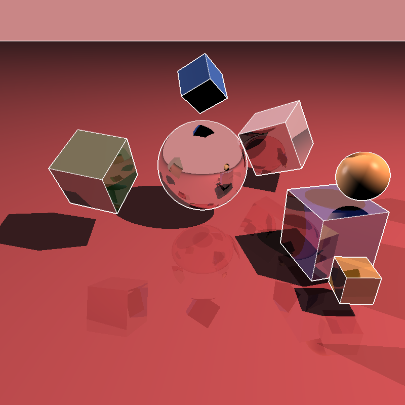
|------------------------|------------------------|------------------------|------------------------|

## Data Flow Diagram
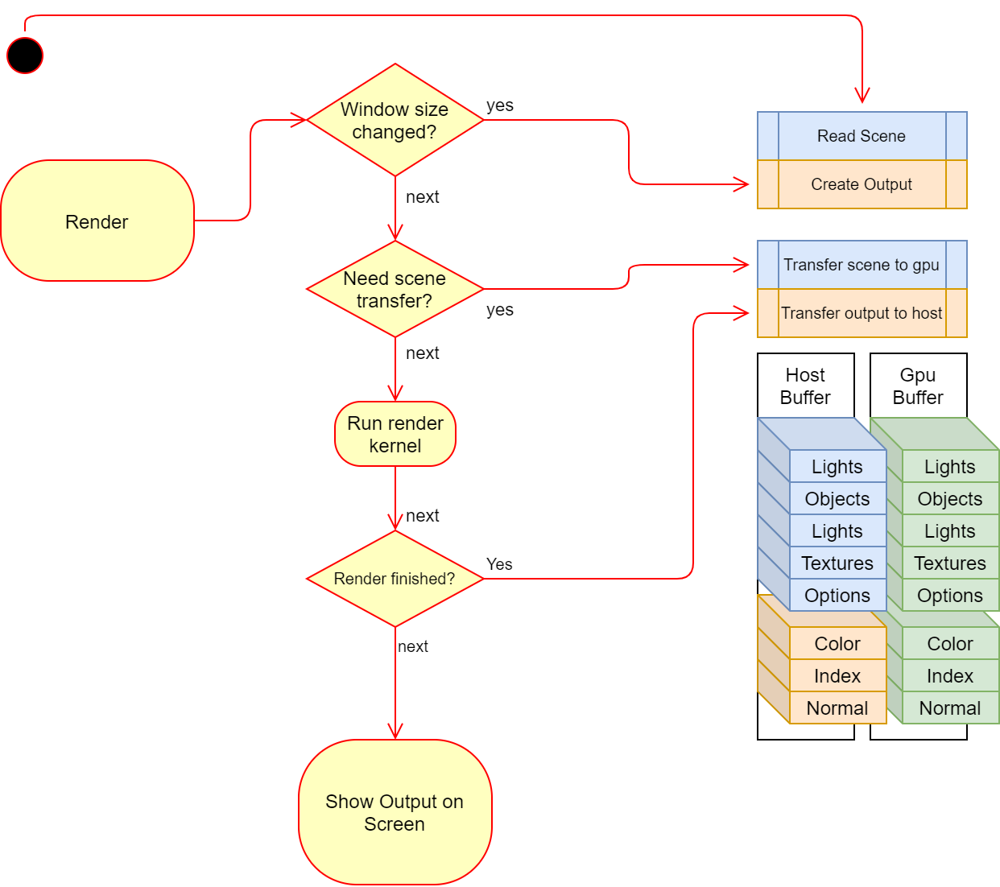
